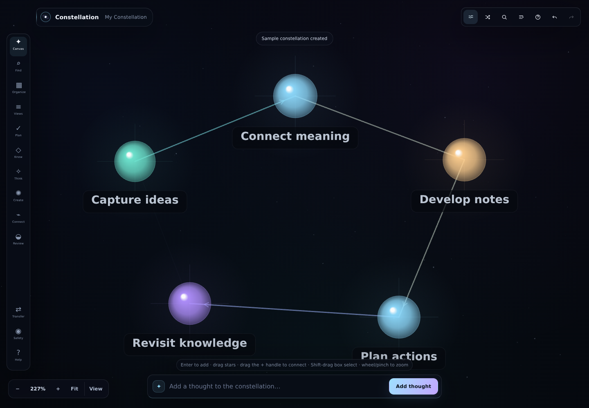
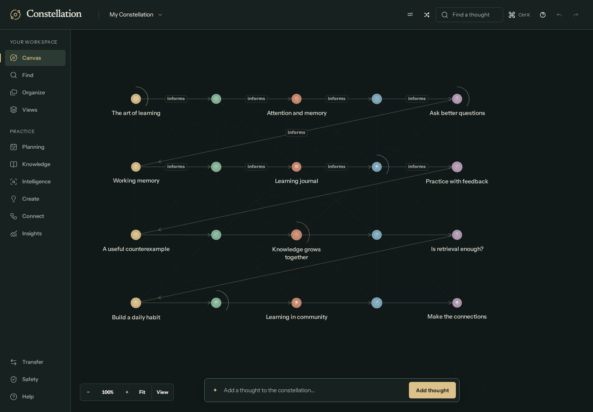
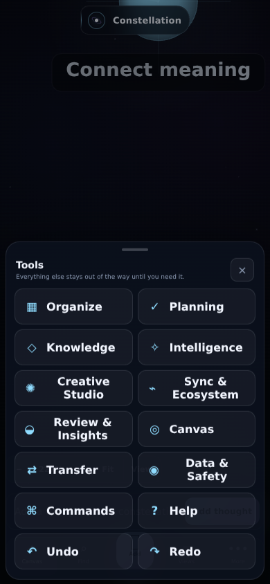
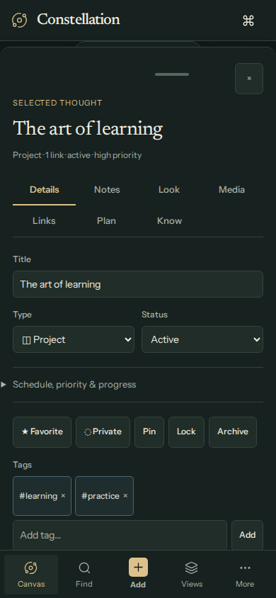
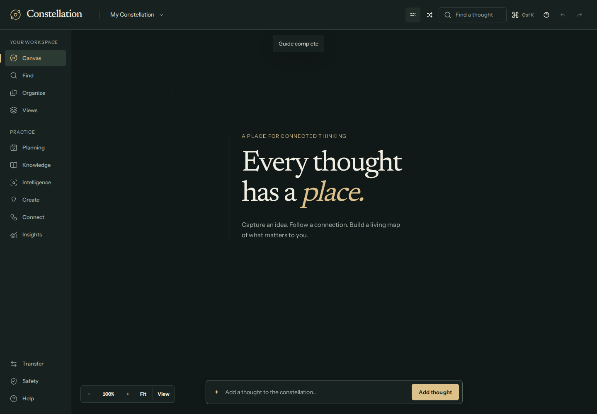
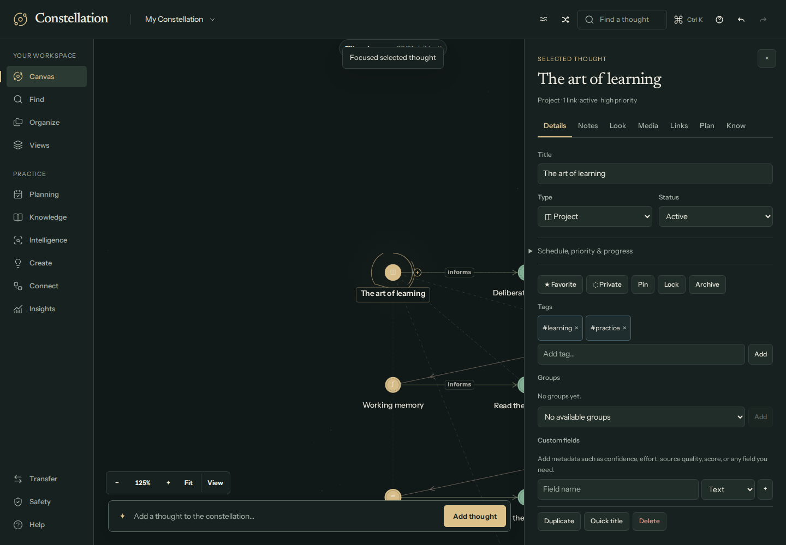
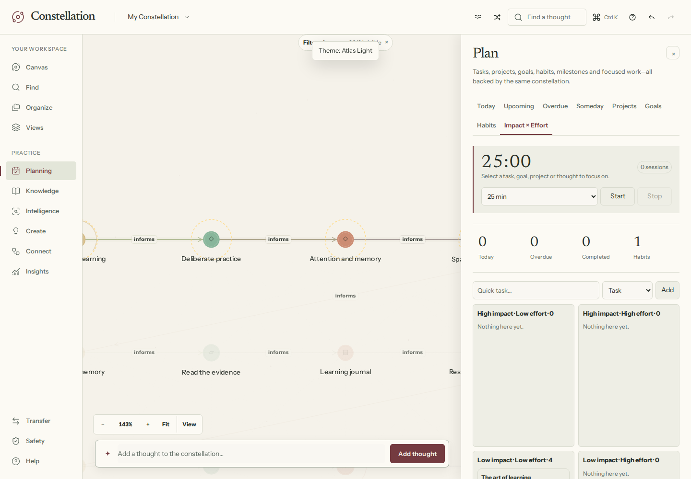
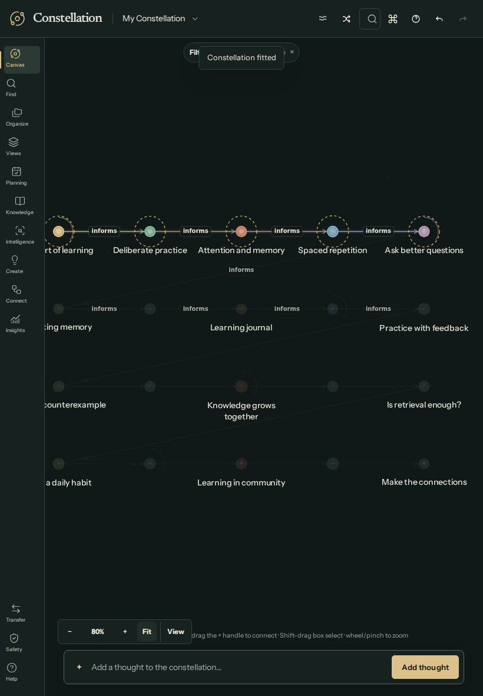
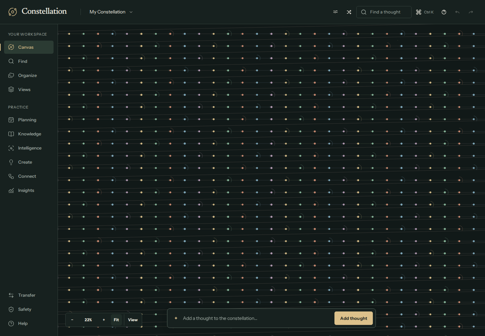

# Observatory — Constellation 2.1 design

## Intent

A contemplative spatial knowledge environment: a warm ink canvas, restrained astronomical marks, editorial typography and tools that read as part of one application. Existing feature logic and storage remain authoritative.

## Baseline audit

The original 2.0 app was run in Chromium before implementation. Nineteen screenshots cover empty and populated canvases, inspector, search, commands, the major tool panels, tablet and mobile canvas/Find/More. This established the shell and panel audit; it was not an exhaustive baseline certification of every secondary workflow.

The main problems were 7–10 px supporting text, rounded glass surfaces surrounding nearly everything, competing glowing graph marks, fragmented navigation, cramped tablet controls, and a mobile More menu with excessive containers. The inspector presented routine writing beside configuration detail with little hierarchy. Search exposed its advanced filter machinery ahead of retrieval. Typography and list rules could carry much of the hierarchy currently carried by boxes.

## Directions explored

Three independently generated visual concepts were evaluated before implementation.

| Direction | System | Strength | Tradeoff |
| --- | --- | --- | --- |
| Editorial Atlas | Ivory paper, oxblood accents, large literary headings, broad labeled navigation, crisp relational diagram and document sidecar | Excellent reading and scanning; distinctive daylight experience | Wide rail and document treatment can overtake the graph on smaller screens |
| Observatory — selected | Warm dark green, brass/sage/terracotta, Instrument Sans and Newsreader, quiet point constellation, compact commands, consistent sidecars | Strong spatial identity; scalable graph marks; comfortable long sessions; clear separation of canvas and task tools | Needs carefully maintained secondary-text contrast and a separately designed light palette |
| Fieldnotes | White drafting table, notebook-like nodes, horizontal navigation and a contextual editing strip | Tangible, approachable, strong individual notes | Large note objects and horizontal navigation are harder to scale to thousands of nodes and narrow screens |

Observatory supplies the coherent production system. Atlas informs the daylight theme. Mobile uses a five-action bottom bar and full-width sheets; tablet uses a compact labeled rail. No new docking, storage or view subsystem was introduced.

## Design system

- **Typography:** embedded Instrument Sans for controls and reading; embedded Newsreader for brand, screen titles, empty states and metrics. Existing user-selectable fonts remain. Titles 28–32 px, primary text 14–16 px, secondary text 12–13 px; graph labels use a 14 px screen-space size. The empty-canvas headline is deliberately larger.
- **Dark roles:** canvas `#111918`, surface `#17211f`, text `#f0ede2`, secondary `#a8b4ac`, brass `#dcc18b`, sage `#8eb9aa`, boundary `#35423d`, focus/boundary strong `#56675e`, danger `#eea397`.
- **Light roles:** canvas `#f5f2ea`, surface `#fcfaf4`, text `#262d27`, secondary `#59665d`, oxblood `#743b40`, green `#376b60`, boundary `#d9dbcf`, danger `#a43939`.
- **Geometry:** 4/8/12/16/24/32 px spacing rhythm; quiet 1 px rules; restrained 4–8 px control corners; flat desktop docks; 14 px upper sheet corners on mobile. Blur is removed. Only light separation shadows remain.
- **Navigation:** 172 px desktop rail; 76 px compact tablet rail; 58 px mobile header and 68 px safe-area-aware bottom bar. Desktop panels share a 480 px dock; tablet uses 430 px; phone sheets use the available width.
- **Controls:** visible focus rings, meaningful accessible names, clear active underline and selected rail marker, distinct disabled and danger states. Mobile inspector tabs wrap into an intentional grid. Advanced inspector scheduling and search filters use native disclosure controls.
- **Graph:** flat semantic points, fine edges, quiet background texture, stronger selected/path feedback, restrained progress and pin/lock marks. Labels stay at screen size and use bounded spatial occupancy to reduce collisions. Existing shapes, semantic types, world geometry, hit testing, physics and camera remain.
- **Motion:** short 180 ms panel opacity/translation; existing spatial transitions; reduced-motion controls retained. No permanent blur or DOM-per-node decoration.
- **Icons:** Lucide SVG navigation with accessible button labels; domain-specific node symbols and user-customizable icons remain supported.

## Workflow changes

| Workflow | Result |
| --- | --- |
| Quick capture | Input and Enter remain one field plus one action; no modal |
| Open a tool | One labeled rail action, or More then a labeled phone action |
| Search | Retrieval input first; advanced filters revealed when needed |
| Edit details | Routine content first; schedule/progress behind a disclosure |
| Close inspector | Visible close button on desktop as well as mobile |
| Keyboard commands | Enter resolves the current input immediately, including during the former debounce window |
| Escape from Knowledge / Intelligence | Both panels now honor the same dismissal shortcut as other tools |
| Phone Notes | Dedicated focus editor, safe-area positioning, viewport resize handling for the software keyboard |

## Architecture and verification

No runtime package dependency or font CDN is required. Font and SVG assets are embedded; licenses are in `THIRD_PARTY_NOTICES.md`. The five-file PWA deployment stays intact. IndexedDB remains `constellation`, version 2. Nineteen protected source contracts guard normalization, recovery, import validation, encryption, graph geometry and physics against accidental edits.

`QA.md` records actual evidence and outstanding acceptance limits. Screenshots are generated by the browser suite and uploaded by CI. The design branch is a release candidate, not automatic production acceptance.

## Review images

Screenshots use deterministic local test data. They show real application controls and canvas rendering.

| Baseline | Observatory |
| --- | --- |
|  |  |
|  |  |

